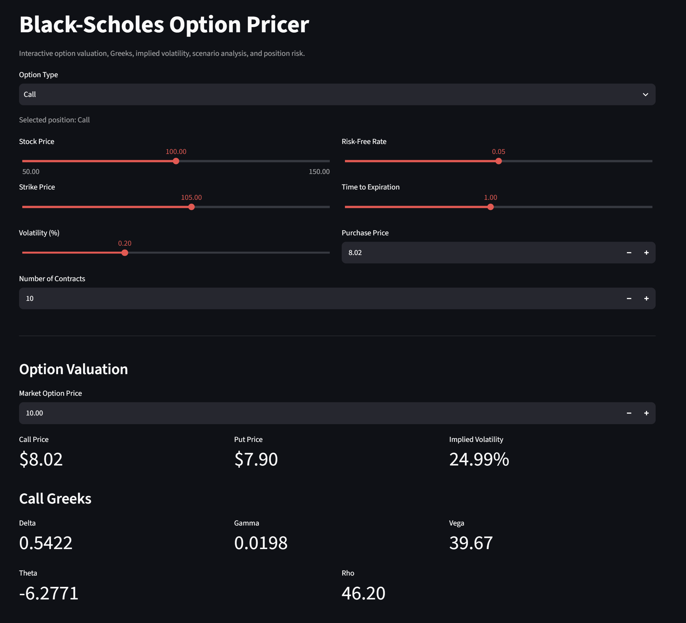
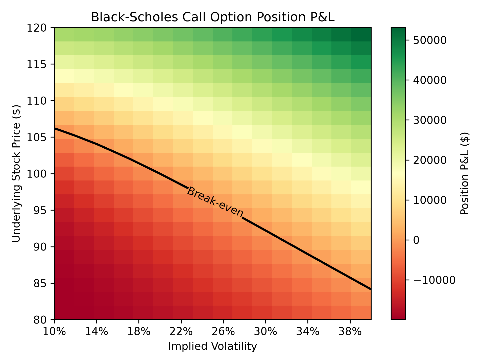

# Black-Scholes Option Pricing & Risk Dashboard

An interactive Python and Streamlit application for pricing European call and put options using the Black-Scholes model. The dashboard provides option Greeks, implied volatility estimation using the Newton-Raphson method, scenario analysis, position-level profit and loss analysis, and interactive risk visualisation.

## 🚀 Live Demo

[Open the Black-Scholes Option Pricer](https://black-scholes-project-axsfhuko9alpn7z9wb6xug.streamlit.app/)

## Dashboard



## Features

- **Black-Scholes Pricing** — Calculates theoretical prices for European call and put options.
- **Option Greeks** — Computes Delta, Gamma, Vega, Theta, and Rho to measure option risk sensitivities.
- **Implied Volatility** — Estimates market-implied volatility using a Newton-Raphson numerical solver.
- **Scenario Analysis** — Tests how changes in the underlying stock price and volatility affect option value and Greeks.
- **Position P&L Analysis** — Calculates profit and loss based on purchase price, number of contracts, and the standard 100-share contract multiplier.
- **P&L Heatmap** — Visualises position P&L across different stock prices and volatility levels, including the break-even contour.
- **Call & Put Support** — Dynamically updates pricing, Greeks, scenarios, and P&L based on the selected option type.

## Mathematical Model

The application uses the Black-Scholes model for European options:

### Call Option

$$
C = S N(d_1) - K e^{-rT} N(d_2)
$$

### Put Option

$$
P = K e^{-rT} N(-d_2) - S N(-d_1)
$$

where:

$$
d_1 = \frac{\ln(S/K) + (r + \frac{1}{2}\sigma^2)T}{\sigma\sqrt{T}}
$$

$$
d_2 = d_1 - \sigma\sqrt{T}
$$

The model uses:

- $S$ — current stock price
- $K$ — strike price
- $r$ — risk-free interest rate
- $\sigma$ — volatility
- $T$ — time to expiration
- $N(\cdot)$ — standard normal cumulative distribution function

### Implied Volatility

Implied volatility is estimated numerically using the Newton-Raphson method:

$$
\sigma_{n+1}
=
\sigma_n
-
\frac{V(\sigma_n)-V_{\text{market}}}
{\text{Vega}(\sigma_n)}
$$

The solver iteratively adjusts volatility until the Black-Scholes model price converges to the supplied market option price. Additional safeguards handle invalid no-arbitrage prices, near-zero Vega, and non-physical volatility estimates.

## Visualisation

### Position P&L Heatmap

The dashboard visualises how the value of an option position changes across different combinations of underlying stock price and implied volatility.



The current position and user-defined scenario are plotted directly on the heatmap, while the break-even contour identifies combinations where the position P&L is approximately zero.

## Project Structure

```text
Black-Scholes-Project/
├── app.py                  # Streamlit dashboard
├── pricing.py              # Black-Scholes pricing model
├── greeks.py               # Option Greeks calculations
├── implied_volatility.py   # Newton-Raphson IV solver
├── requirements.txt        # Python dependencies
└── README.md               # Project documentation

## Assumptions & Limitations

The Black-Scholes model relies on several simplifying assumptions:

- Options are European and can only be exercised at expiration.
- The risk-free interest rate and volatility are assumed to remain constant.
- Stock prices follow a lognormal distribution.
- Markets are assumed to be frictionless, with no transaction costs or taxes.
- The underlying asset pays no dividends.
- Continuous trading and borrowing/lending at the risk-free rate are assumed.

As a result, model prices may differ from observed market prices, particularly when these assumptions do not hold.

## Running Locally

Clone the repository:

```bash
git clone https://github.com/siyushen0109-rgb/Black-Scholes-Project.git
cd Black-Scholes-Project